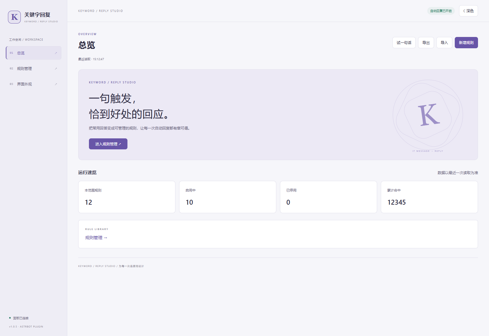
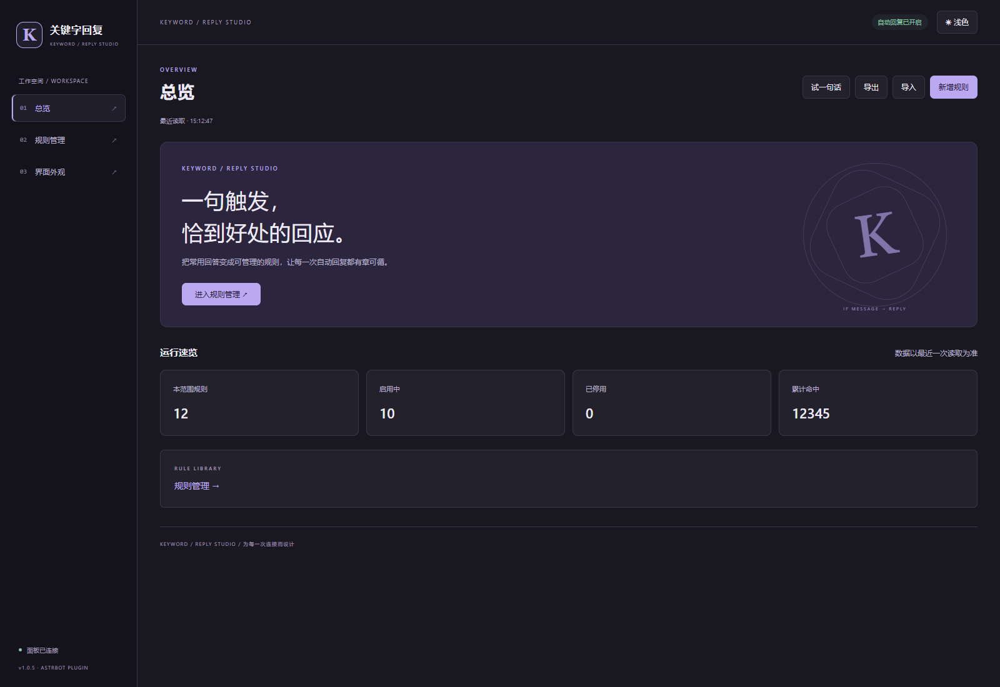

# astrbot_plugin_keyword_reply

关键字自动回复插件，带 Web 面板。一条规则四个字段，和面板表单一一对应：

| 关键字 | 匹配类型 | 回复 | 格式 |
| --- | --- | --- | --- |
| 活动地址 | 精准匹配 | 一个活动地址 | MD格式 |
| 在吗 | 模糊匹配 | 在的，{sender}，有什么事？ | 文本 |

> 更新日志见 [Releases](https://github.com/Lianzy-Baimiao/astrbot_plugin_keyword_reply/releases)。

## Web 面板首页预览

支持右上角一键切换 **浅色 / 深色**，也可在「界面外观」中选择跟随 AstrBot；未提供宿主主题时默认浅色。主题及紧凑布局偏好保存在当前浏览器，手机窄屏下自动调整布局，宽表格可横向滚动。

- 页面导航：总览、规则管理与界面外观；保留匹配测试和规则导入 / 导出。
- 统一统计卡片标签与数值排版、复选框及筛选工具栏对齐。
- 使用本地 HTML / CSS / JavaScript，无需前端构建或外部图标字体；通过 AstrBot Plugin Pages 桥接访问后端。

**浅色首页**



<details>
<summary>查看深色首页</summary>



</details>

> 预览图来自本地浏览器测试，使用模拟数据，不代表真实机器人运行状态。更新日志见各仓库 Releases。

## 安装

把整个 `astrbot_plugin_keyword_reply` 目录放进 `AstrBot/data/plugins/`，重启 AstrBot。

需要 AstrBot >= 4.24.1（插件自定义页面 Plugin Pages 从这个版本开始提供）。没有额外的 pip 依赖。

## Web 面板

AstrBot WebUI → 插件 → 关键字回复 → 打开面板。

面板能做的事：

- 增删改规则，四个字段都是下拉或输入框，匹配类型和格式不用记英文枚举
- 按范围切换：`全局（所有会话）` 或某个具体的群/私聊，**下拉里显示群名**（`魔兽世界交流群（339466990）`）
- **选择群…**：按群名 / 群号搜索机器人所在的全部群，选中即切过去 —— 不用再对着群号猜哪个群
- 搜索关键字和回复内容
- 启用 / 停用单条规则（停用不删数据）
- **试一句话**：输入一段文本，看它命中哪几条规则、实际会回哪条、占位符渲染成什么样
- 导入 / 导出 JSON，方便备份和在多个 bot 之间搬规则
- 一键切换浅色 / 深色，或跟随 AstrBot WebUI 主题；偏好自动记忆

面板前端位于 `pages/keyword-reply/`，由 `index.html`、`style.css`、`shell.js` 和 `app.js` 组成，使用原生 JS，不需要构建步骤。数据通过
`window.AstrBotPluginPage` 桥接调用后端接口，不自己拼 URL、不带 token。

## 群名是怎么来的

QQ 的 OneBot 群消息事件本身不带群名，所以「群号 → 群名」由插件自己攒，三种来源：

1. **收消息时**：事件自带群名的平台（Telegram / Discord / QQ 官方等）直接用，写进缓存
2. **首次见到某个群**：后台异步问一次 OneBot `get_group_info`（不阻塞消息处理，每个群只问一次）
3. **面板点「刷新群列表」**：调一次 `get_group_list`，把机器人所在的**所有**群一次补齐 ——
   刚装好插件、群里还没说过话的群也能按群名挑到（30 分钟内重复点不会重复打平台接口）

名字要在同一 umo 拼法下匹配才用得上，换平台实例名（如 `napcat` → `default_666666666`）时
会按「群号 + 平台」再兜一次。实在查不到名字就显示 `群 群号`，功能不受影响。

## 匹配类型

| 类型 | 说明 | 举例（关键字 = `活动`） |
| --- | --- | --- |
| 精准匹配 | 整条消息完全等于关键字 | 只有 `活动` 命中 |
| 模糊匹配 | 消息里含关键字 | `今天有活动吗` 命中 |
| 前缀匹配 | 消息以关键字开头 | `活动地址是啥` 命中 |
| 后缀匹配 | 消息以关键字结尾 | `说说这次活动` 命中 |
| 正则匹配 | 关键字当正则用 | `活动.*地址` 命中 `活动的地址` |

多条同时命中时，按「优先级高的优先 → 精准 > 前缀/后缀 > 正则 > 模糊 → 关键字长的优先」
挑一条回复。所以一条 `活动地址` 的精准规则不会被 `活动` 的模糊规则抢走。

正则写错不会让插件崩，那条规则直接不生效，面板保存时也会当场报错。

## 回复格式

- **文本** — 原样发纯文本。
- **MD格式** — 默认把 markdown 渲染成图片再发（QQ 不支持富文本，图片最稳）。渲染失败自动
  回落成纯文本，不会一条都发不出去。想直接发 markdown 原文，在插件配置里把
  `MD格式回复的发送方式` 改成 `text`。

回复内容里可以用这些占位符：

```
{sender}    发送者昵称
{group}     群号（私聊为空）
{keyword}   命中的关键字
{date}      2026-01-01
{time}      12:00:00
{datetime}  2026-01-01 12:00:00
```

其他大括号原样保留，所以回复里写 markdown 表格或 JSON 不会出问题。

## 全局规则和会话规则

规则分两级：

- **全局** — 对所有群和私聊生效
- **某个会话** — 只对那个群/私聊生效

同一个「关键字 + 匹配类型」两边都有时，会话规则盖掉全局那条。适合「全局一套通用回复，
某个群单独改掉其中一条」。

## 聊天命令

管理员在群里也能改，不用开面板：

```
/关键字 列表                    看本群规则
/关键字 添加 关键字|匹配类型|回复|格式
/关键字 删除 <id 或 关键字>
/关键字 开关 <id>               启用 / 停用
/关键字 测试 <文本>             看这句话会命中哪条
/关键字 帮助
```

加「全局」二字操作全局规则，如 `/关键字 全局添加 ...`、`/关键字 全局列表`。

例：

```
/关键字 添加 活动地址|精准匹配|一个活动地址|MD格式
```

后两段可以省，匹配类型默认精准匹配、格式默认文本。分隔符 `|` 和中文 `｜` 都认。

`列表` 和 `测试` 所有人可用，增删改只有管理员能用。

## 插件配置

在 AstrBot WebUI 的插件配置页里改，改完立即生效不用重启：

| 配置项 | 默认 | 说明 |
| --- | --- | --- |
| 启用关键字自动回复 | 开 | 总开关。关掉后规则还在，只是不自动回复 |
| 匹配时忽略大小写 | 开 | 对英文关键字有用，中文无影响 |
| MD格式回复的发送方式 | image | `image` 渲染成图片，`text` 发 markdown 原文 |
| 同一会话回复冷却（秒） | 0 | 防刷屏，0 = 不限制 |
| 命中后阻止其他插件继续处理 | 开 | 关掉则关键字回复可以和别的插件同时生效 |
| 私聊也自动回复 | 开 | 关掉则只在群聊生效 |
| 白名单 | 空 | 非空时只在名单内的会话生效。填群号或 unified_msg_origin |
| 黑名单 | 空 | 名单内的会话不生效，优先于白名单 |

## 数据存放

```
AstrBot/data/plugin_data/astrbot_plugin_keyword_reply/rules.json    规则
AstrBot/data/plugin_data/astrbot_plugin_keyword_reply/groups.json   群名缓存（展示用，可删）
```

`groups.json` 结构：

```json
{
  "version": 1,
  "last_refresh": 1766000000.0,
  "groups": {
    "napcat:GroupMessage:339466990": {
      "platform_id": "napcat",
      "group_id": "339466990",
      "group_name": "魔兽世界交流群",
      "member_count": 486,
      "source": "api",
      "updated_at": 1766000000.0
    }
  }
}
```

`source` 是名字来源（`event` = 事件自带，`api` = 平台接口查的）。缓存最多留 800 条，超了按
`updated_at` 淘汰最旧的；删掉整个文件也只是清掉名字（重新显示成群号），不影响规则。

结构：

```json
{
  "version": 1,
  "scopes": {
    "global": [ { "keyword": "活动地址", "match": "exact", "reply": "...", "format": "markdown" } ],
    "napcat:GroupMessage:12345": [ ]
  }
}
```

写盘是原子的（临时文件 + replace），写一半断电不会留个坏 json。文件被外部改坏时按空库
启动，坏掉的单条规则跳过而不是整个文件作废。

## 开发

纯逻辑和存储层不依赖 astrbot，本地直接跑：

```bash
python tests/test_rules.py
python tests/test_store.py
python tests/test_groups.py
python tests/test_main_smoke.py
```

`test_main_smoke.py` 会把 `astrbot.*` 塞进 `sys.modules` 再导入 `main.py` 和 `page.py`，
所以语法错误、名字写错、面板接口回归本地就能拦下来。`test_groups.py` 是群名缓存的纯逻辑
单测（平台返回值的三种形状、坏文件恢复、淘汰策略都在里面）。四个文件全绿打印 OK。

代码分工：

| 文件 | 作用 | 依赖 astrbot |
| --- | --- | --- |
| `keyword_reply/rules.py` | 规则归一化、匹配、排序、占位符 | 否 |
| `keyword_reply/store.py` | 存盘、查询、导入导出 | 否 |
| `keyword_reply/groups.py` | umo 解析、群名缓存与展示文字 | 否 |
| `keyword_reply/page.py` | Web 面板后端接口 | 是（有 quart 回落） |
| `main.py` | 消息钩子、聊天命令、向平台取群名 | 是 |
| `pages/keyword-reply/index.html` | 面板前端 | — |

`page.py` 同时兼容 AstrBot >= 4.26 的 `astrbot.api.web` 和更早版本的裸 quart，两套
API 的 `request.query` / `request.args`、`request.json()` / `request.get_json()` 差异
在内部包了一层。


### Web 面板更新

- 独立工作台布局，提供浅色 / 深色切换、主题记忆及窄屏适配。
- 统一运行速览标签与数值的对齐，移除标签前的小方块装饰。
- 统一复选框与筛选工具栏对齐，保留原有业务接口。
